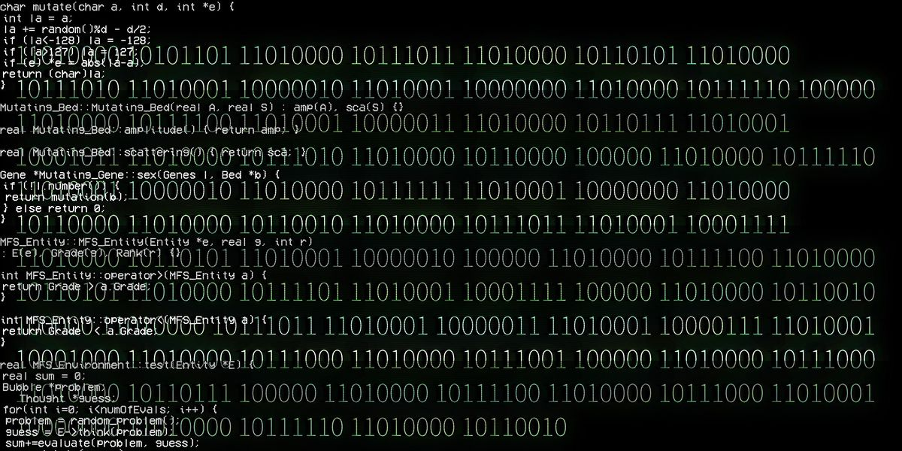

<h1 align="center">Gabriel Rocha</h1>

  

  
  &nbsp;
  
  &nbsp;
  

---

<h3 align="center">Sobre mim</h3>

  <i>"No matter where you go, everyone is connected."</i>
  <i>- Serials Lain</i>

 

  Sou Gabriel Rocha, Desenvolvedor Fullstack que iniciou sua jornada na programação aos 13 anos, movido por uma curiosidade profunda despertada pelos jogos e pelo funcionamento dos sistemas por trás deles.
  
Sou apaixonado por construir, aprender e evoluir constantemente. Valorizo a comunicação e o trabalho em equipe, e estou sempre aberto a trocar ideias, ouvir outras pessoas e crescer junto com elas. Acredito que um bom software não é feito apenas de código, mas também de colaboração e entendimento.

Trabalho com tecnologias modernas como Node.js, TypeScript, JavaScript, Vue.js, React, Docker e Figma, sempre buscando criar soluções funcionais e bem estruturadas.

Sempre aprendendo. Sempre construindo. Sempre conectado.

 

  ▸ Fullstack Developer 
  ▸ TypeScript • React • Vue • Node • Python 

---

<h3 align="center">⚙ Tecnologias</h3>

  

---

<h3 align="center">📈 Status</h3>
<table width="100%">
  <tr>
    <td width="50%">
      
    </td>
    <td width="50%">
      
    </td>
  </tr>
</table>
